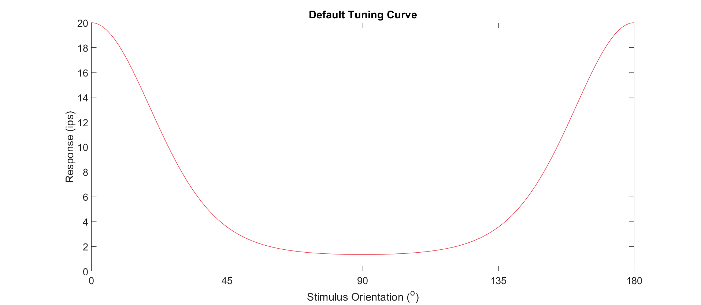
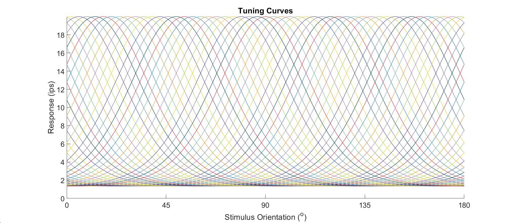
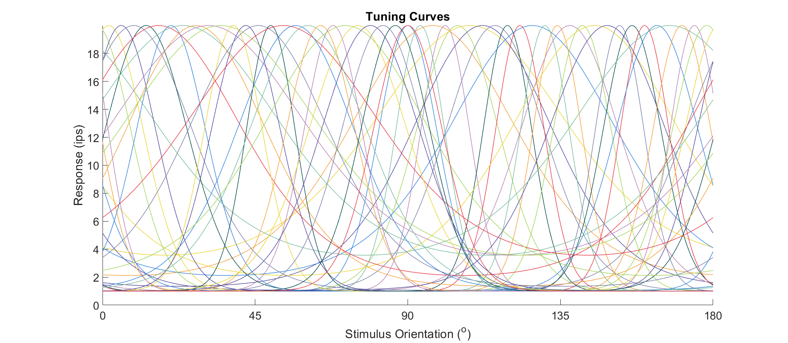
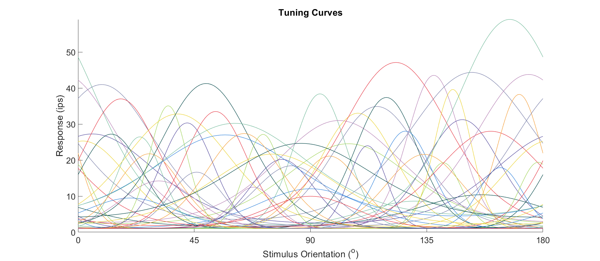
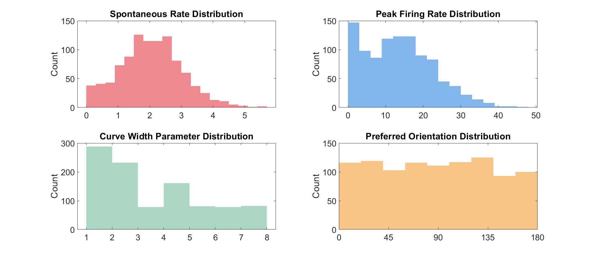
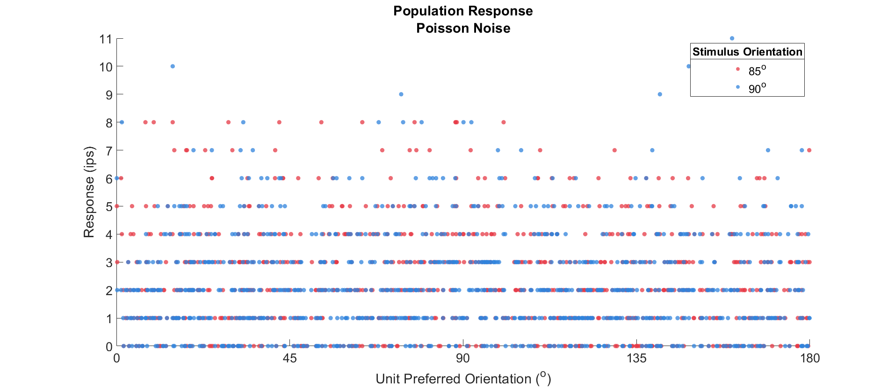
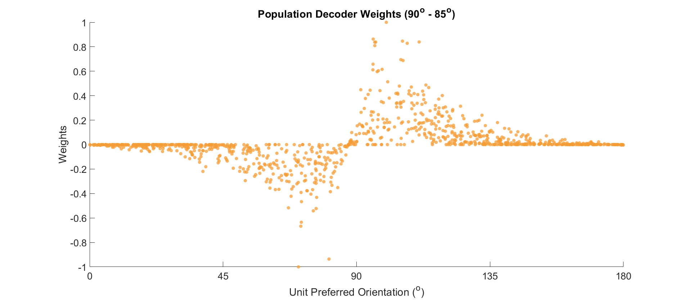
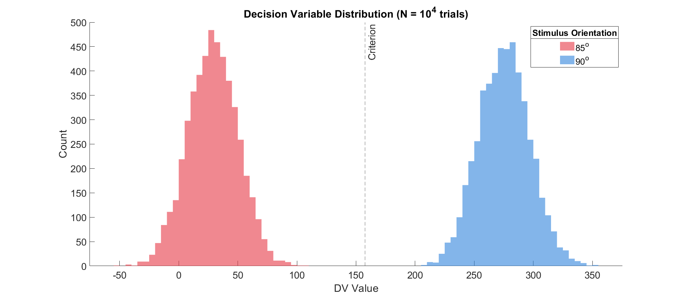
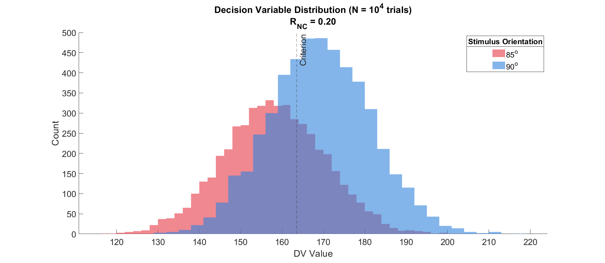
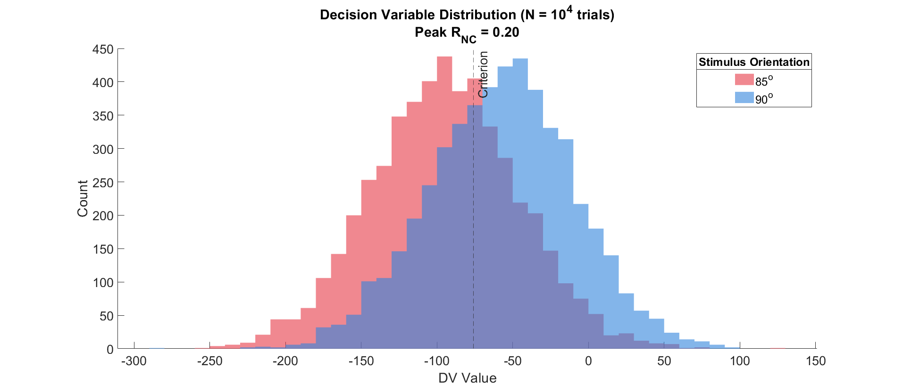

# Global versus Local Noise Correlations and Their Effects on Decoding

Model constructed for the 2022 Cold Spring Harbor Laboratory Computational Vision summer camp.

* Recreates and adapts the model described in Ecker et al., 2011.
* Simulates a noisy population of neurons with a variety of stimulus orientation preferences. Orientation preferences can have homogeneous or heterogeneous tunings widths and peak heights.
* Additionally simulates population data with between-unit noise correlations with amplitudes proportional to their nearness in orientation selectivity space. Effectively, units with more similar stimulus preferences will have more similar noise.
* Decode encoded stimulus orientation and compare decoding performances across various sets of neuronal population properties.

# Noise Correlations and Their Effects

First, what are noise correlations?

Noise correlations are when the non-stimulus-evoked activity 
of multiple neurons is correlated. As an example, if an experimenter
records a pair of neurons and finds that, even on trials where there 
is no visual stimulus shown, the two neurons tend to have high 
spontaneous firing rates on the same trials as each other and low 
spontaneous firing rates on the same trials as each other, the two 
neurons would be said to have a positive noise correlation.

So, why does this matter?

Noise correlations are generally considered a bad thing from the 
perspective of decoding neural activity. If all neurons in a given 
population were independent, that is, completely uncorrelated, then 
it's an ideal situation for decoding: simply total up the population 
and take the average. If there's genuine visual stimulus information 
to be decoded, then the population in general should "agree" and you 
can extract that information to inform a decision.

Unfortunately, noise correlations complicate things. Imagine a situation 
where regardless of the visual information present (in the most deprived 
case this would be a situation where there is _no_ visual information), 
the neuronal population had high noise correlation and most members 
of said population tended to swing high or low in unison. The population 
"agrees" in general but this agreement would not be informed by the 
visual stimulus information that we're trying to extract in the first 
place; this would be maladaptive.

But, are all forms of noise correlation harmful?

One can construct different structure of noise correlations. The 
hypothetical outlined above is for global noise correlations: i.e., 
members of the population that have positive noise correlations do 
not have anything in common in terms of their selectivities. But 
what if we could change the way these noise correlations are applied 
throughout a population? The model detailed here simulates that 
potential situation.

# Constructing the Model

We can construct example tuning curves for our simulated neurons.
Here, we'll go with V1 neurons: they'll have some firing rate which 
varies smoothly as a function of distance from their preferred 
stimulus orientation. We'll use vos Mises tuning functions with the 
following form:

```math
R \left( \theta \right) = \alpha + \beta \exp \left( \gamma \left[ \cos \left( \theta - \phi \right) - 1\right] \right)
```

For simulated neurons with tuning functions defined as above, 
$\alpha$ would be the spontaneous rate, $\beta$ would be the maximum 
firing rate of the neuron relative to the spontaneous rate (and thus 
$\alpha + \beta$ would be the absolute maximum firing rate), $\gamma$ 
would be the relative tuning width (a measure of the sensitivity of the 
neuron for its preferred orientation), and $\phi$ would be its preferred 
stimulus orientation.

Displayed below is the tuning curve for an example neuron with a spontaneous 
rate of 1 impulse per second (ips), a maximum firing rate of 20 ips, and 
a preferred orientation of $0\degree$. The $\gamma$ parameter is 
set to 2.



We can expand this out across preferred orientations, generating a set of 
tuning functions with preferred orientations which uniformly tile across all
possible orientations:



And here we can get even more varied. We can construct a population with varied
tuning widths; i.e. different neurons have different "tolerances" for their
preferred orientations:



And even more varied. We can now vary tuning strengths: two neurons with equal 
tolerances for preferred orientation may have varying amplitudes of response.



With this, we can simulate some tens of thousands of neurons which have all 
manner of variety in their tuning parameters.

## Empirical Visualization of Tuning Parameters

As you can see from the below histograms of the spontaneous rates (red), 
peak rates (blue), tuning widths (green), and preferred orientations (orange), 
we can put together a very large population of neurons with various distributions 
of each parameters. 



I've opted for a Gaussian distribution for the two rate 
parameters and an exponential decay distribution for the tuning widths; I want 
most of the neurons to have relatively narrow tuning widths. It wouldn't make
much sense for our system to be biased in its ability to extract different
orientations of visual information, so the distribution of preferred 
orientations will be uniform.

# Simulating Responses

We can now take our simulated population and see how the units will fire
in response to be "shown" visual stimuli of varying orientation. In this case, 
let's keep things simple. On a given trial, we'll show the population a stimulus 
that is either $85\degree$ or $90\degree$:



As you can see, we have units tiling fairly evenly across the x-axis thanks to 
our uniform preferred orientation distribution. Because the two orientations 
we're testing are similar, we're not seeing much of an obvious difference 
between the $85\degree$ (red) and $90\degree$ (blue) data. If you're wondering 
these data are arranging themselves in such neat horizontal lines, it's because
I've elected to add a Poisson noise process to our simulated units, which restricts
the firing rates to non-negative integer quantities.

# Decoding Stimulus Information

And now that we have some simulated responses, we can try decoding the stimulus 
information. That is, given the activity we're "recording" from this system, are 
we able to tell what the identity of the visual stimulus was?

First, we need to construct a decoder. The most straightforward one is what we 
refer to as a match-template decoder. For a given unit, we'll take the average difference 
between its responses to the two stimulus orientations we're interested in. 
Below I've displayed each unit's weights, this difference, as a single orange point; you should 
be able to appreciate which units appear to be most informative for this by seeing 
the preferred orientations of the units which have the largest absolute value in this
plot.



We're doing this very quick and dirty. If I were to do this in a more rigorous way, 
I would construct a "ground truth" decoder based on the unnoised version of our 
population responses. But you rarely have access to ground truth; let's pretend 
we're actually trying to decode recorded physiological activity.

Now all that's left is to take the response of each unit on a given trial, 
multiply it against its decoder weight, and then take those products and sum them 
them all together within the population to end up with a single number, which 
we refer to as the Decision Variable (DV). 

## Decision Variable Distributions

We can collect DVs across all the trials and end up with a distribution of DVs. 
In order to try to discriminate trials of varying orientations (i.e., we want to
be able to state whether a given trial had a stimulus with $85\degree$ or $90\degree$
orientation), we'll need a Criterion to compare against. Each DV will be compared 
against the criterion on a trial-by-trial basis and then be assigned a label of 
$85\degree$ or $90\degree$: this will be the decoder's "choice," or judgment of 
stimulus orientation.

Let's visualize the DV distribution, with ground truth stimulus orientations
displayed using color, for a neuron population that is fully independent,
no noise correlations. There is noise in general, but this noise itself is 
independent relative to any given pair of neurons.




As you can see, there's literally no overlap between the red and blue distributions.
This task is too easy in this state; the decoder is literally performing at 100%
correct.

But now let's add in some noise correlations. Here, we'll make it so any given unit
has about an R value of 0.2 to every other neuron in the population.



And now we can appreciate the appearance of a substantial overlap. Remember,
our decoder will label any trials to the right of the criterion as " $90\degree$ " 
and any trials to the left as " $85\degree$ ." This means that a substantial
number of trials are being miscategorized by the decoder. Hopefully, this gives at 
least the beginnings of an intuition for how this kind of noise correlation can
seriously affect decoding accuracy.

Now, let's try something more structured. We can create "tuning-local" noise correlations
within our simulated population (you can check out the code to see the particulars
of how I did this). This effectively means that for a given pair of neurons, 
the noise correlation between the two has a magnitude which is _dependent on how
similar their preferred orientations are_. Let's see the DV distribution for this 
population:



While it's a bit difficult to intuit, there is indeed less of an overlap and the 
decoder is now performing better than before despite the fact that there are
noise correlations within the population.

The interesting thing about this is that it isn't very difficult to imagine
a physiological situation where this could happen. All we would need is for
neurons of similar stimulus preferences to be more horizontally connected with one 
another than with neurons of dissimilar preferences.
